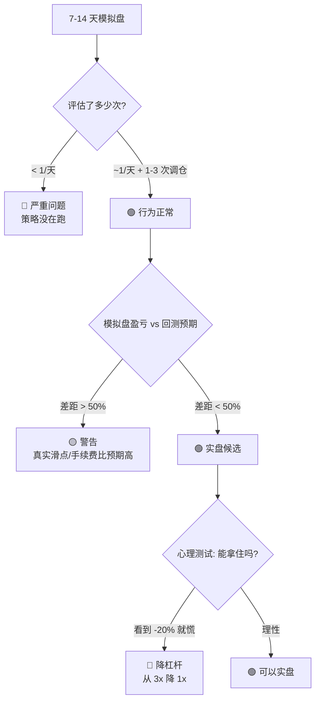

# 模拟盘长跑指南

为期 7-14 天的模拟盘验证。**实盘前的必要环节**，不能跳过。

## 启动前清单（必须全部 ✅）

### 1. 代码端

```bash
go build -o bin/gotrader ./cmd/gotrader   # 编译
go test ./...                              # 全测过
```

### 2. config.yaml 端

```yaml
okx:
  live: false              # 🔴 必须 false
  api_key/secret/passphrase 已填入

strategy:
  name: "tsmom"            # 或 vmm
  inst_id: "ETH-USDT-SWAP" # 想跑的标的
  leverage: 3              # 必须 = OKX 后台设置的杠杆
```

### 3. OKX 模拟盘账户端（必须手动设置！）

1. 登录 OKX → 右上角切到 **「模拟交易」**
2. 模拟账户充值 USDT（如果余额 < 1000，点 "Refill" 按钮）
3. 进合约页面 → 选 `ETH-USDT-SWAP` → 杠杆调到 **3x**
4. 账户偏好：
   - 持仓模式：**单向持仓**（双向需要改代码）
   - 保证金模式：**全仓 (cross)**

⚠️ **不做这些设置启动会大概率失败**：要么下单被拒（杠杆 1x 时仓位太小），要么 PosSide 不匹配报错。

---

## 日常使用

```bash
scripts/run.sh        # 启动后台进程
scripts/status.sh     # 一目了然看状态
scripts/stop.sh       # 优雅停止
tail -f logs/gotrader-$(date +%Y%m%d).log   # 实时跟日志
```

### `status.sh` 输出例子

```
===== gotrader 状态 (2026-05-25 09:00:00) =====

🟢 进程运行中  PID=12345  已运行=1-02:03:45  内存=42MB

📁 今日日志: logs/gotrader-20260525.log (1.2M, 5234 行)

--- 最近 3 次策略评估 ---
  level=INFO msg="TSMOM 评估" past_return=-0.05 ann_vol=0.36 target_dir=SHORT ...

--- 最近 3 次下单 ---
  level=INFO msg=订单已下 instId=ETH-USDT-SWAP side=sell strategy_size=0.2 okx_size=2 ...

✅ 今日无 ERROR/WARN
```

---

## 每天检查（5 分钟）

按 Linus "数据说话"，重点看这 3 件事：

### ✅ 该有的

1. **每天 UTC 00:00（北京 08:00）有一次 `TSMOM 评估`** — 1D K 线收盘后才评估
2. **调仓时有 `订单已下` 日志带 `okx_size=N`** — N 是张数，不是基础币数量
3. **下单失败有报错** — 不能静默失败

### ⚠️ 异常信号

| 现象 | 可能原因 | 处理 |
|---|---|---|
| 启动几小时没有评估 | bar=1D 等到 UTC 00:00 才有 | 正常，耐心等 |
| `下单失败 sCode=51000` | 杠杆没设 / 余额不够 | 去 OKX 后台检查 |
| `下单失败 sCode=51015` | 张数为 0 (size 太小) | 增大 base_position_usd |
| WS 断开重连频繁 | 网络问题 | 看 backoff 退避是不是合理 |
| 内存涨到 GB 级 | 内存泄漏 bug | 截 pprof，开 issue |

---

## 验收标准（跑完 7-14 天）



### 量化指标

| 指标 | 7 天目标 | 14 天目标 |
|---|---|---|
| 策略评估次数 | ≥ 7 | ≥ 14 |
| 调仓次数 | 1-3 | 2-5 |
| 任意失败下单 | = 0 | = 0 |
| WS 断开次数 | < 5 | < 10 |
| 实际收益与回测预期偏差 | < 50% | < 30% |

任何一条不达标 → **不要上实盘**。

---

## 上实盘前的最后检查

```bash
# 1. 模拟盘完整跑过 7-14 天，且 status.sh 多次显示一切正常
# 2. 模拟盘账户最大回撤 < 40%（跟回测对得上）
# 3. 心理准备：见过 -10% 回撤还能拿住
# 4. 资金准备：实盘资金 = 你能 100% 承受归零的钱

# 切换实盘（小心！）
vi config.yaml   # 改 okx.live: true
# ★ 重新启动前先 OKX 实盘账户：
#   - 设置 ETH-USDT-SWAP 3x 杠杆
#   - 单向持仓 + 全仓
#   - 充入实盘资金
./bin/gotrader -config config.yaml   # 不用 scripts/run.sh，前台跑前几天密切观察
```
